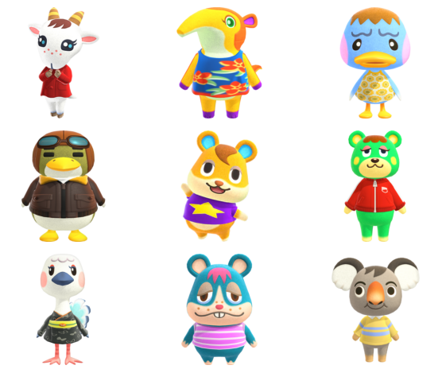
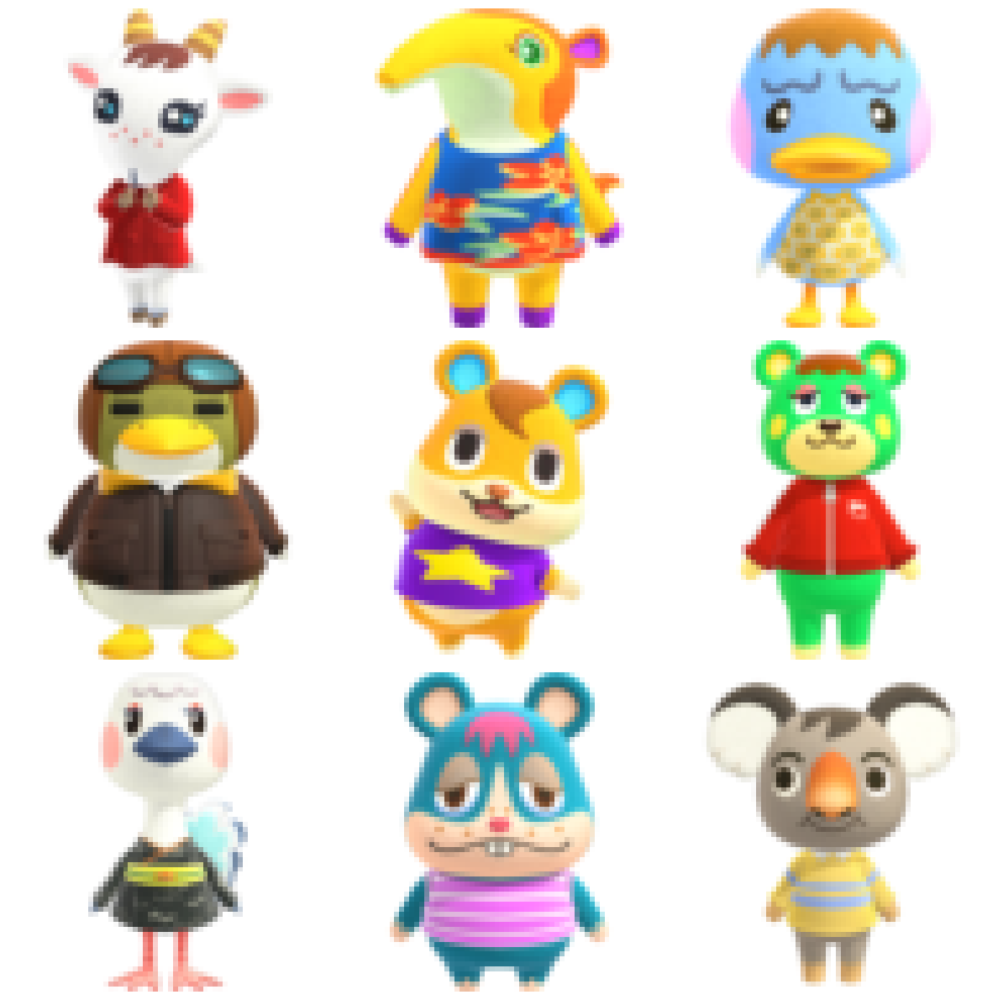
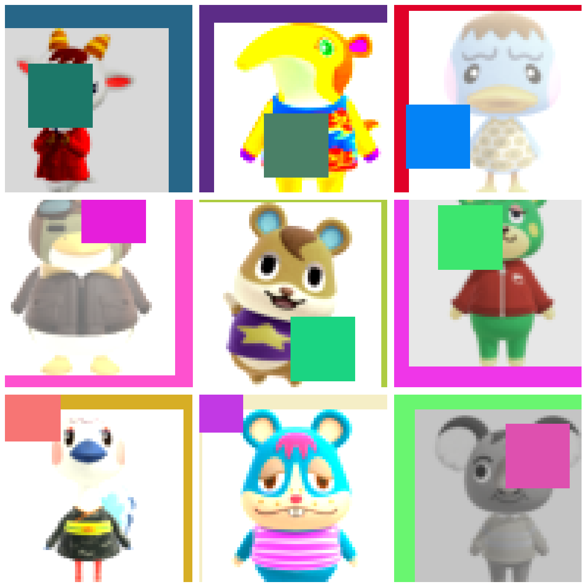
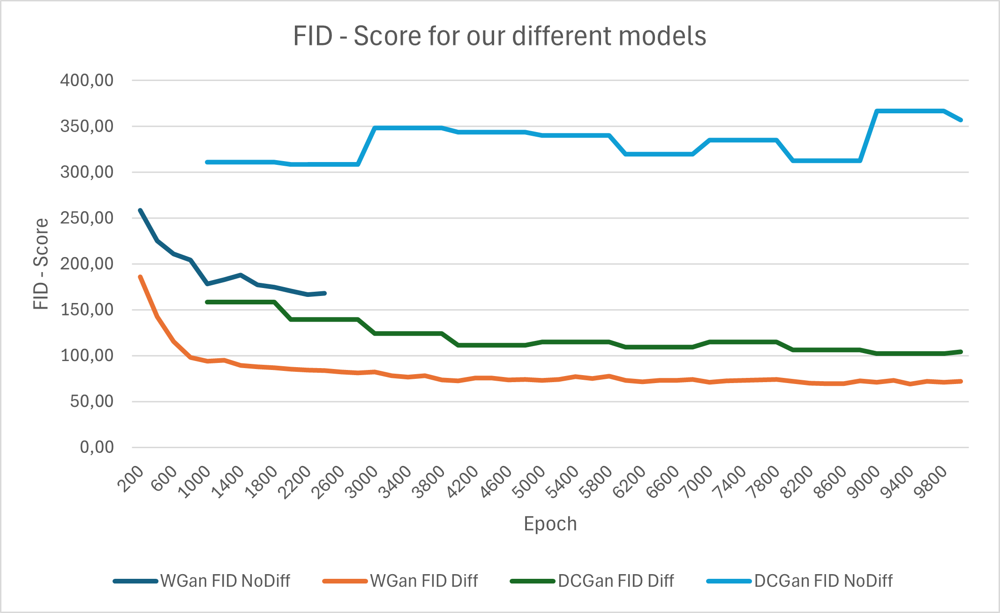
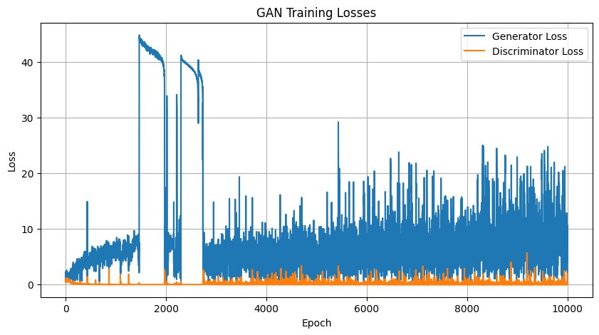
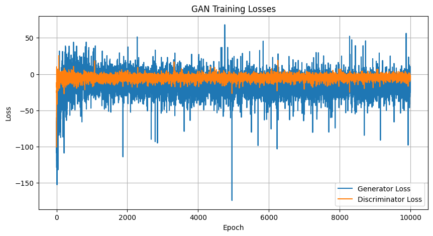
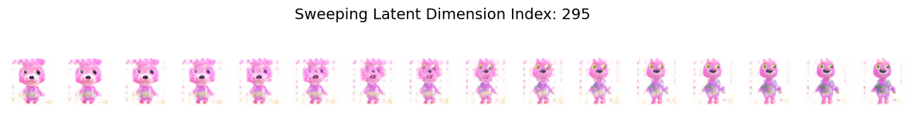
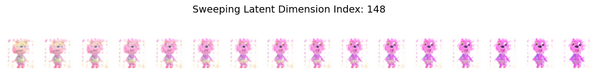
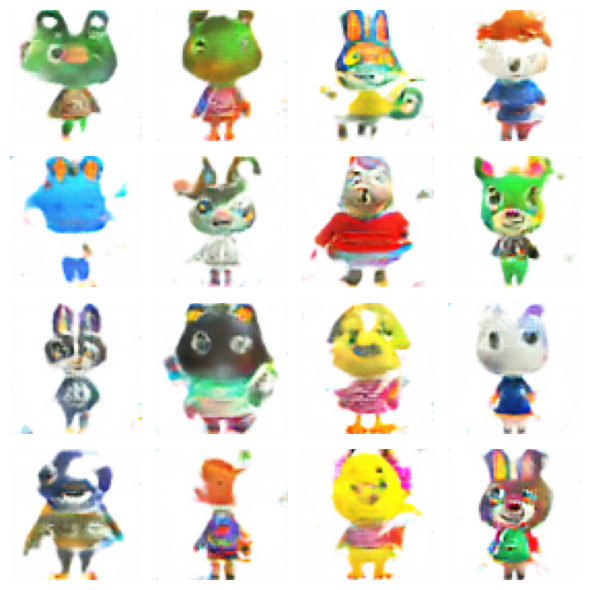
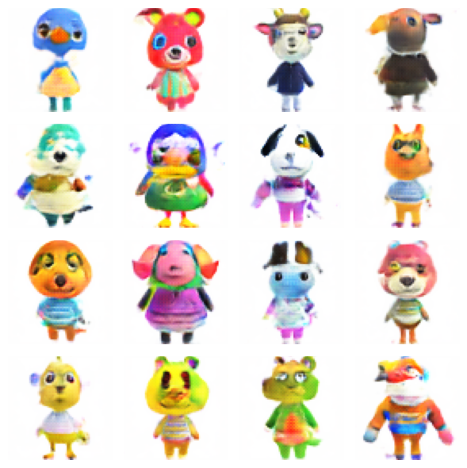

# AML-2026-Miniproject

**Project:** Generating novel Animal Crossing villagers with GANs

**Group members:** Emilia Victoria Helsted (ehel), Sebastian Cloos Hylander (sehy), Thorbjørn Peter Høgsbro Pedersen (tpep)

This repository contains our miniproject for the course **Advanced Machine Learning (Spring 2026)**. This project explores generative adversarial networks (GANs) to generate novel Animal Crossing-style villager images. The goal is to learn stylistic features from existing characters and generate novel, coherent designs.

## Dataset

Our dataset consists of unlabelled images of Animal Crossing villagers collected from [kaggle](https://www.kaggle.com/datasets/jahysama/animal-crossing-new-horizons-all-villagers/data). A limitation of our dataset is its relatively small size (392 images), which makes training GANs challenging and prone to overfitting or mode collapse. Another issue is that the images have varying sizes. To address this all images were padded with white pixels to make when square and then resized to 64x64 pixels. Additionally, images with transparent backgrounds were converted from RGBA to RGB to make all backgrounds fully white.

- Image format: JPG
- Image resolution: Varies. Avg width: 216.67. Avg height: 348.82
- Dataset size: 392 images

  

     
    Original dataset
  

  

     
    After preprocessing
  

We chose not to apply direct transformations to the dataset such as flipping or rotation. Since the images are full-body portraits and many villagers are symmetric, such augmentations would introduce unrealistic samples and potentially harm training. Instead we make use of differentiable augmentation.

### Differentiable Augmentation

Differentiable augmentation applies the same random but differentiable image transformations to both real and generated images during GAN training, allowing gradients to flow through the augmentations. This improves stability and reduces overfitting.

     
    Sample dataset with differentiable augmentation
  

## Models and Architectures

The standard GAN consists of a discriminator and a generator, trained in an adversarial manner. The discriminator is trained to differentiate between real and synthetic input, while the generator tries to generate output that fools the discriminator.

### Models

We have trained the following models:

- DCGAN
- WGAN-GP

### DCGAN Architecture

Our deep convolutional GAN (DCGAN) follows a standard architecture.

### WGAN-GP Architecture

For our Wasserstein GAN with gradient penalty (WGAN-GP), we changed the discriminator to a critic that outputs a real-valued score instead of a probability. To do this we have removed the batch normalization and the final Sigmoid activation from the discriminator.

## Training Setup

We have used the following parameters for both models:

- Latent dimension: 300
- Batch size: 32
- Optimizer: Adam
- Training epochs: from 2000-10000 (dependent on time constraints)

For each epoch we train the discriminator first followed by training of the generator.

### DCGAN Training

- Loss function: binary cross-entropy loss
- Optimizer hyperparameters:
  - ADAM betas: 0.5, 0.999
  - discriminator learning rate: 0.0003
  - generator learning rate: 0.0001

### WGAN-GP Training

For the WGAN-GP, the discriminator (critic) was updated multiple times per epoch, and a gradient penalty term was introduced to stabilize training.

- Loss function: Wasserstein loss
- Optimizer hyperparameters:
  - ADAM betas: 0.5, 0.999
  - Discriminator learning rate: 0.0003
  - Generator learning rate: 0.0001
  - Ratio for critic: 5
  - Lambda for gradients penalty: 10

## FID Fréchet inception distance

We used Fréchet inception distance (FID) to compare the results of the models. It gives a score that reflects how close the generated images are to the original images that we train the model on.

## Experiments

We trained the DCGAN and WGAN-GP both with and without using differentiable augmentation and used FID to compare the results of the different models. Further details on hyperparameters can be seen in "training setup". We also looked at the training loss and generated pictures at different epochs to try to find out what happens during training.

## Observations and Results

- We see that the discriminator overfits to the dataset without the use of differentiable augmentation, making training of the generator difficult.

- Without the use of differentiable augmentation, we see signs of mode collapse in our DCGAN.

- Using differentiable augmentation, we see improved results for both models. Looking at our FID-scores the diffaug versions clearly perform better than their respective alternatives from the start and throughout the training.

- Our WGAN-GP with diffaug gets a FID score of 72.69 after 4000 epochs. Then training somewhat stagnates with a best score of 68.92 after 9400 epochs and a final score of 72.2 after 10000 epochs.

  

    

       
      FID graph of the models across their training epochs
    

  

- Training loss
  - Our worst-performing DCGAN (the one that does not use diffaug) clearly has a discriminator that produces a loss that is too high for the generator, resulting in poor training of the generator. We observe several large spikes in the training loss, leading to mode collapse.

  

    

       
      dcgan_nodiffaug_trainingloss
    

  

  - Our best WGAN-GP model (using diffaug) appears to maintain a more balanced min-max game between the generator and the discriminator throughout training. While the FID scores show that the generator's improvement stagnates, the model shows no signs of mode collapse.

  

    

       
      wgan_withdiffaug_trainingloss
    

  

### Interpolations

- We made a visualizer to help us inspect the latent space of the generators. We used this to inspect the latent space of our best model (WGAN-GP with DiffAug). Due to the latent dimensionality being 300, it appears that many of the parameters have little influence on the generated image and some parameters seem to produce similar effects. This suggests that we could have gone for a smaller latent dimension. We did however see a few dimensions that have a clear and narrow effect to the villager:

  

     
    Latent dim 295 shows a transition from big head to small head
  

  

     
    Latent dim 148 shows a transition from looking sideways to looking straight
  

### Example Outputs

  

     
    Output of DCGAN with diffaug after 10000 epochs
  

  

     
    Output of WGAN-GP with diffaug after 10000 epochss
  

## Discussion

- FID was a nice tool to use to get a metric to assess the quality of the models. Other methods like Inception Score and subjective assessment could also have been relevant.
- It is hard to find the best latent space, model architecture and hyperparameters for a problem. It seems like an endless assignment to go through different variations. Using automatic tools for some of it could be interesting.

### Key Takeaways

- Differentiable augmentation improves training stability and helps prevent mode collapse when training on a small dataset. Helps mitigate mode collapse.

## Use of Generative AI

For good measure it is worth mentioning that, while all workflows in the notebooks, the training process, and the structure of our project is made by us, some portions of the code were produced with the help of ChatGPT and/or other LLMs.

## Relevant Litterature

- Ou, Xunxiong (2024).
  [_Deep Convolutional Generative Adversarial Networks (DCGAN)-Based Anime Face Generation_](https://www.atlantis-press.com/proceedings/iciaai-24/126004091)
- Zhao, Shengyu et al. (2020). [_Differentiable Augmentation for Data-Efficient GAN Training_](https://arxiv.org/abs/2006.10738)
- Gulrajani, Ishaan et al. (2017).
  [Improved Training of Wasserstein GANs](https://arxiv.org/pdf/1704.00028)
- [GAN — Wasserstein GAN & WGAN-GP](https://jonathan-hui.medium.com/gan-wasserstein-gan-wgan-gp-6a1a2aa1b490) (Medium article)
- [Tackling Mode Collapse in GANs: From DCGAN to WGAN-GP](https://aneelabashir425.medium.com/medium-article-tackling-mode-collapse-in-gans-from-dcgan-to-wgan-gp-0b31c7ac3692) (Medium article)
- [GAN hyperparameter tuning](https://apxml.com/courses/generative-adversarial-networks-gans/chapter-7-gan-implementation-optimization/hyperparameter-tuning-gans)
